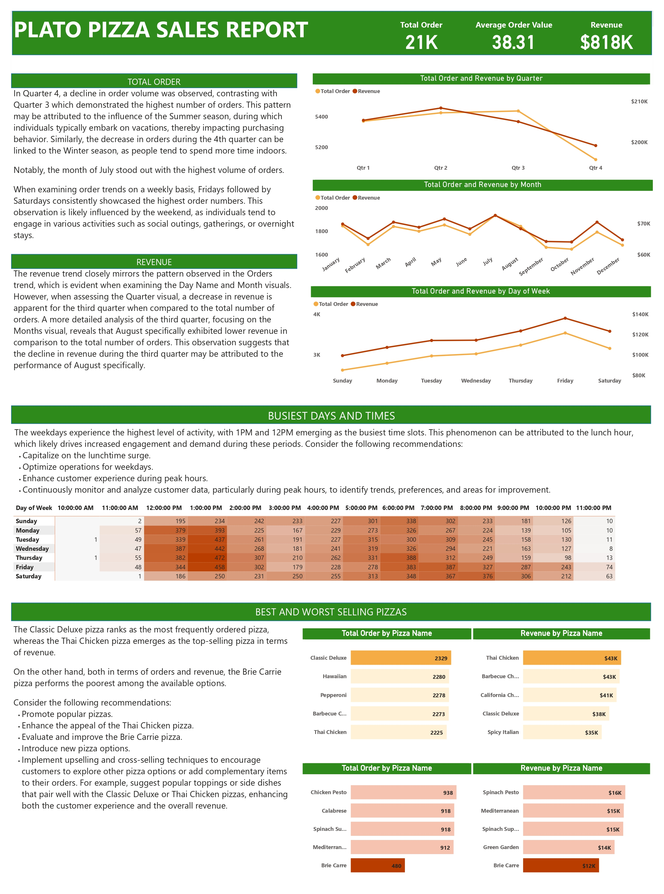

# Pizza_Sales_Report

## Introduction
This project was done for a fictional pizza place. The aim was to analyze the data and put together a report to help find opportunities to drive more sales and work more efficiently. The dataset has a year's worth of sales and contains 4 different tables in CSV format namely; Orders, Order Details, Pizzas, and Pizza Types. The data also came with a data dictionary and a project brief.

## Problem Statement
The following questions were stated in the project brief;
- What days and times do we tend to be busiest? 
- What are our best and worst selling pizzas? 
- What's our average order value? 
- How much money did we make this year? Can we identify any seasonality in the sales? 

## Power BI tools used:
- DAX
- New measures
- Power query

## Analysis
### Data Sourcing
This data was gotten from [Kaggle.com](https://www.kaggle.com/datasets/mysarahmadbhat/pizza-place-sales)

### Data Cleaning
Before loading to power query on power BI, I merged all the data from the different tables to one csv file using microsoft excel. 
In power query, I made sure the data type of each column was accurate. I also checked for blank columns but there was none.
The dataset was not really messy so there was not a lot of cleaning to be done.

### DAX and Visualization
Before working on the data I created a New Measures table to put in every measure that will be calculated.
1. Total number of orders

This was gotten using `Total order = COUNTA(Orders[order_id])`, and visualized using the Card visual. 
2. Revenue

Revenue is gotten from price and quantity. The Order Details table had **quantity** and **pizza_id**, but the Pizzas table had only **price**. So in the data view, I used a "related" function to bring the **price** column to the Order Details table. I first made sure there was a connection between the Order Details table and the Pizzas table, if there's no connection,the calculation won't work.
I clicked on the order_details table, right clicked --> new column. Then used the DAX function `Price = RELATED(pizzas[price])`. 
To calculate total price, I clicked on the order_details table, right clicked --> new column. 
Then I calculated total price using `Total Price = order_details[quantity] * order_details[Price]`.             
In report view, in the New Measures table, Revenue was calculated, `Revenue = SUM(order_details[Total Price])`, and visualized using a Card visual.

3. Average order value

`Average Order Value = [Revenue] / [Total Order]`. Card visual.
4. Quarterly, Monthly, and Daily Sales

Used a line chart to visualize quarterly, monthly, and daily sales by total order and revenue. Total Order as Y-axis, and Revenue as Secondary Y-axis. 
The Day of Week tile (a single visual is referred to as a tile) was showing as number of day "1,2,3..." instead of day of week "mon, tues, wed,..." on the X-axis. So I went to power query, Orders table -->Date column -->Add Column tab -->Date, day, name of day. Voila! Close and Apply. 
To sort the day of week chronologically, I went to power query again and created a conditional column called Day Sort. The column had Sunday as 1, Monday as 2, etc. Close and apply. On PBI desktop, I clicked on the Day Name column (day of week) -->Column Tools tab --> Sort by column, sort by Day Sort. In the tile, Sort axis -->Day Name. 
That's how to arrange an axis the way you want.

5. Busiest Days and Times

To get the time "11:32, 10:58, etc" into hours "12:00,11:00", I went to power query and created a custom column in the Orders table named Hours with the formula
`Number.Round(Number.From([time]) * (60*24/60)) / (60*24/60)`. Close and Apply. Before creating this custom column, I split the "Time" column in the by the space delimeter because it had date also.
Used a matrix visual. I put Day Name in Row, Hours in Column, and Order_ID in Values (you may use Total Order instead, you'll still get the same values). Then I used conditional formatting to highlight the busiest days and times.

6. Best and Worst Selling Pizzas

In power query, I removed "the" and "pizza" from the pizza name column. 
These pizzas were represented by Revenue and by No of Orders using a bar chart. For best I filtered by Top 5, then Bottom 5 for last.

After getting all the visuals, I googled pizza colour palette because I wanted my report to look real. We strive for excellence over here 😌

Then I went ahead to type my insights and recommendations and arrange the report beautifully.

## Report
This is my best work yet.

I had a lot of help from YouTube so I'm going to take a moment to thank God for YouTube, and also thank Idris Alugo for his [videos](https://www.youtube.com/watch?v=ItkDG5zboi8). He may never know but I am eternally grateful.

